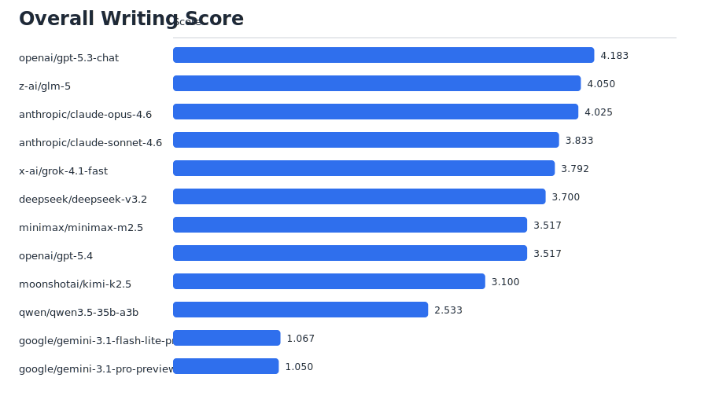

# ZinsserBench

ZinsserBench is a benchmark for AI nonfiction writing.

It asks a simple question: which models write the best nonfiction for real readers?

## Leaderboards

Most visitors want the current results first. The most recent run in this repo is `2026-03-07-openrouter-v0-1`, using benchmark version `v0.1`.

- Important note: this was a very early `v0.1` run using OpenRouter with `--reasoning-effort medium`. Treat the results as directional, not definitive.
- Important note: the two Gemini candidate models had an OpenRouter failure in this run. They spent most of their token budget on reasoning and returned visibly truncated text, so they are excluded from the README leaderboard below.
- Prompts: `20`
- Candidate models: `12`
- Judge panel: `openai/gpt-5.4`, `anthropic/claude-opus-4.6`, `google/gemini-3.1-pro-preview`
- Prompt mix: `4` explainers, `4` memos, `3` profiles, `3` service guides, `3` opinion pieces, `3` personal nonfiction essays

### Writing leaderboard

If you only want the headline: in this run, `openai/gpt-5.3-chat` ranked first on writing quality, followed by `z-ai/glm-5` and `anthropic/claude-opus-4.6`.

Scores are on a `1` to `5` scale. Higher is better. Gemini candidate models are omitted here because their saved generations were truncated by the upstream failure noted above.



### Judge agreement

This benchmark also checks how closely each judge matches the rest of the panel. In this run, `google/gemini-3.1-pro-preview` had the highest agreement, narrowly ahead of `openai/gpt-5.4`.


Latest report: [runs/2026-03-07-openrouter-v0-1/analysis/REPORT.md](runs/2026-03-07-openrouter-v0-1/analysis/REPORT.md)

Response length audit: [runs/2026-03-07-openrouter-v0-1/analysis/response_lengths_by_model.csv](runs/2026-03-07-openrouter-v0-1/analysis/response_lengths_by_model.csv)

## Introduction

The benchmark is inspired by William Zinsser, the journalist, editor, teacher, and author of *On Writing Well*. Zinsser argued that good nonfiction should be lucid, economical, concrete, and alive on the page. This repo does not ask models to imitate his voice. It uses his recurring principles as a practical standard for judging modern AI writing.

## What this benchmark measures

ZinsserBench scores each response on seven dimensions:

- `clarity`: easy to understand on a first read
- `simplicity`: plain, direct language without puffed-up wording
- `brevity and economy`: no wasted space, repetition, or throat-clearing
- `structure and flow`: ideas arrive in a logical, readable order
- `specificity and precision`: concrete details instead of vague abstraction
- `humanity and voice`: sounds written for people, not by committee
- `overall effectiveness`: overall nonfiction quality for the task

The goal is not literary imitation. The goal is strong public-facing prose.

## How it works

At a high level, the process is straightforward:

1. ZinsserBench gives every candidate model the same set of nonfiction writing prompts.
2. The prompts cover several common forms: explainers, internal memos, profiles, practical how-to guidance, opinion writing, and personal nonfiction.
3. A separate judge panel scores every response on the rubric above.
4. The repo aggregates those scores into two headline views:

- `writing score`: how well a model writes across the full benchmark
- `judge quality`: how closely a judge agrees with the rest of the panel

This makes the benchmark useful for two different questions:

- Which models currently write the strongest nonfiction?
- Which models are the most reliable judges of nonfiction quality?

## Why the benchmark focuses on nonfiction

A great deal of real-world AI writing is nonfiction: memos, consumer explainers, civic guides, service writing, profiles, and opinion pieces. These are not edge cases. They are everyday forms that people read to understand work, institutions, money, health, policy, and one another.

Nonfiction is where weak writing habits become obvious. Models can hide behind flourish in fiction; they have less room to hide when they need to explain, persuade, or inform plainly.

## Prompt design

Version `v0.1` uses `20` prompts:

- `memo`: `4`
- `explain`: `4`
- `profile`: `3`
- `service_howto`: `3`
- `persuasion_oped`: `3`
- `personal_nonfiction`: `3`

Prompts are intentionally short and direct. They do not ask for Zinsser pastiche or elaborate stylistic role-play. The benchmark is trying to measure writing quality, not prompt-following on a baroque instruction set.

## Repo guide for nontechnical readers

If you only want the results:

- Read the latest report: [runs/2026-03-07-openrouter-v0-1/analysis/REPORT.md](runs/2026-03-07-openrouter-v0-1/analysis/REPORT.md)
- Check response lengths: [runs/2026-03-07-openrouter-v0-1/analysis/response_lengths_by_model.csv](runs/2026-03-07-openrouter-v0-1/analysis/response_lengths_by_model.csv)
- View the charts in `runs/2026-03-07-openrouter-v0-1/analysis/`
- Inspect `writing_by_model.csv` for the leaderboard
- Inspect `model_prompt_details.csv` for prompt-by-prompt performance

## Technical details

### Repository layout

```text
benchmark_versions/<version>/
  prompts.json
  rubric.json
  models.json
  judges.json

runs/<run_name>/
  manifest.json
  outputs/
  judgments/
  analysis/
```

Benchmark versions are intended to be immutable. If you materially change prompts, rubric, or scoring policy, create a new version directory and rerun the benchmark for that version.

### Installation

ZinsserBench is a small Python package with no external runtime dependency declared beyond Python itself.

```bash
python3 -m venv .venv
source .venv/bin/activate
pip install -e .
```

You can also run it directly from source:

```bash
PYTHONPATH=src python3 -m zinsserbench --help
```

### Configuration

The benchmark uses two versioned config files for model selection:

- `benchmark_versions/<version>/models.json` for candidate models
- `benchmark_versions/<version>/judges.json` for the judge panel

The current `v0.1` judge panel is intentionally lightweight:

- `openai/gpt-5.4`
- `anthropic/claude-opus-4.6`
- `google/gemini-3.1-pro-preview`

### Running the benchmark

OpenRouter is the default live backend.

```bash
cp .env.example .env
# then edit .env and set OPENROUTER_API_KEY=...
zinsserbench run \
  --root . \
  --benchmark-version v0.1 \
  --run-name 2026-03-07-openrouter-v0-1 \
  --backend openrouter \
  --generation-concurrency 4 \
  --judge-concurrency 4 \
  --reasoning-effort medium \
  --max-output-tokens 500
```

On startup, the CLI loads `.env` and `.env.local` from `--root` if present. Existing shell environment variables still take precedence.

Existing runs are resumable. If work is partially complete, reuse the same `--run-name` instead of starting over.

### Running stages separately

Each stage skips artifacts that already exist.

```bash
zinsserbench generate --root . --benchmark-version v0.1 --run-name 2026-03-07-openrouter-v0-1 --backend openrouter
zinsserbench judge --root . --benchmark-version v0.1 --run-name 2026-03-07-openrouter-v0-1 --backend openrouter
zinsserbench analyze --root . --run-name 2026-03-07-openrouter-v0-1
```

### OpenRouter handling

This repo includes defensive handling for provider quirks that have shown up in live runs:

- some providers return `content: null` after spending tokens on reasoning
- some providers need a retry with reasoning disabled and a larger token budget
- some providers return `429` with `retry_after_seconds`, which should be honored instead of treated as a fatal failure
- judge calls should stay in JSON mode

When OpenRouter supports reasoning controls for a model, ZinsserBench sends reasoning effort while excluding returned reasoning blocks by default. Models that do not support the parameter ignore it.

### Analysis outputs

For each run, `runs/<run_name>/analysis/` contains:

- `summary.json`
- `REPORT.md`
- `response_lengths_by_model.csv`
- `writing_by_model.csv`
- `writing_by_model_axis.csv`
- `writing_by_model_category.csv`
- `writing_by_model_prompt.csv`
- `writing_by_prompt_axis.csv`
- `judge_quality.csv`
- `model_prompt_details.csv`
- headline SVG charts

`model_prompt_details.csv` is the main drill-down table for inspecting a specific model and prompt together with its aggregated rubric scores.

### Testing

The test suite uses the standard library only.

```bash
PYTHONPATH=src python3 -m unittest discover -s tests -v
```
