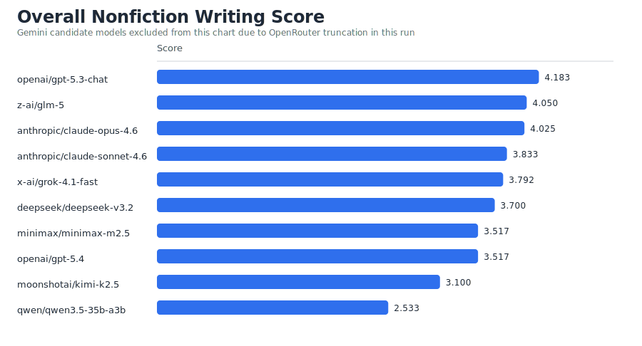
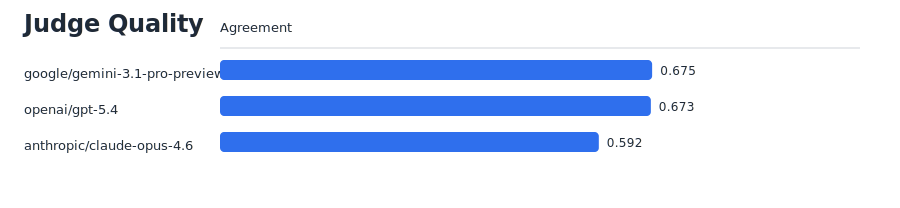

# What the first ZinsserBench run actually tells us

**Run:** `2026-03-07-openrouter-v0-1` · **Benchmark version:** `v0.1` · **Models:** 12 candidates, 3 judges · **Prompts:** 20 across 6 categories

This is a qualitative analysis of the first ZinsserBench run. The quantitative report (in `runs/2026-03-07-openrouter-v0-1/analysis/REPORT.md`) has the raw leaderboard. This document asks what those numbers mean.

---

## The leaderboard at a glance

| Rank | Model | Overall | Clarity | Simplicity | Structure |
| ---: | --- | ---: | ---: | ---: | ---: |
| 1 | GPT-5.3 Chat | 4.18 | 4.83 | 4.77 | 4.30 |
| 2 | GLM-5 | 4.05 | 4.73 | 4.38 | 4.18 |
| 3 | Claude Opus 4.6 | 4.03 | 4.74 | 4.57 | 3.98 |
| 4 | Claude Sonnet 4.6 | 3.83 | 4.67 | 4.57 | 3.85 |
| 5 | Grok 4.1 Fast | 3.79 | 4.63 | 4.03 | 3.72 |
| 6 | DeepSeek V3.2 | 3.70 | 4.62 | 4.25 | 3.77 |
| 7 | MiniMax M2.5 | 3.52 | 4.55 | 4.52 | 3.70 |
| 8 | GPT-5.4 | 3.52 | 4.58 | 4.63 | 3.53 |
| 9 | Kimi K2.5 | 3.10 | 4.18 | 4.12 | 3.13 |
| 10 | Qwen 3.5 35B | 2.53 | 3.27 | 3.10 | 2.63 |
| 11 | Gemini 3.1 Flash Lite | 1.07 | 1.88 | 2.63 | 1.13 |
| 12 | Gemini 3.1 Pro | 1.05 | 1.30 | 1.98 | 1.02 |



Before drawing conclusions from this table, we need to talk about what went wrong.

---

## 1. Technical failures: not every model got a fair shot

Three models in this run suffered from truncation issues that make their scores unreliable measures of writing quality.

### Gemini: catastrophic truncation

Both Gemini models hit an OpenRouter failure mode where they spent most of their token budget on internal reasoning and returned almost nothing. Gemini 3.1 Pro averaged just 83 characters per response. Gemini 3.1 Flash Lite averaged 155 characters. For context, the prompts asked for pieces in the range of 200-500 words, and the healthy models averaged 1,700-2,300 characters. What the judges received from Gemini was typically a sentence fragment or a bare opening line.

Their bottom-of-the-table scores (1.05 and 1.07 overall) reflect truncation, not writing ability. These results should be excluded from any writing-quality comparisons.

### Kimi K2.5: a hidden truncation problem

Kimi K2.5's issue is subtler and not mentioned in the README's caveats. On at least six of the twenty prompts, Kimi returned severely truncated responses: 50 characters for the remote work policy memo, 116 for the corner store op-ed, 148 for the ferry captain profile, 153 for the public pool essay, and 187 for the public defender profile. Those are fragments, not essays. On other prompts, Kimi wrote 1,900-5,900 characters of competent prose.

This means Kimi's overall score of 3.10 is a blend of genuine writing (likely scoring in the 3.8-4.2 range on healthy prompts) and near-zero outputs that dragged it down. Its real writing ability is probably closer to the mid-tier models than its 9th-place finish suggests.

### GPT-5.4: partial truncation

GPT-5.4 had two noticeably short responses: 384 characters on the first-day-at-the-union-job prompt and 454 on the public defender profile. On the personal nonfiction prompt, it also included placeholder text ("[Insert Date]") rather than generating a complete piece. Every other response was in the normal 1,500-2,300 range.

GPT-5.4 finished 8th with a 3.52 overall score, tied with MiniMax M2.5. That's surprising for a flagship model that also serves as one of the three judges. The partial truncation probably cost it a few tenths of a point. Its true writing ability, based on the 18 healthy prompts, is likely in the 3.7-3.9 range, which would put it squarely in the middle tier.

**Takeaway:** Of the 12 models, only 9 had clean runs. Any analysis of writing quality should focus on those 9.

---

## 2. What separates the top tier from the rest

Among the nine models with clean outputs, three clearly separated themselves: GPT-5.3 Chat (4.18), GLM-5 (4.05), and Claude Opus 4.6 (4.03). The next cluster—Claude Sonnet 4.6 (3.83), Grok 4.1 Fast (3.79), DeepSeek V3.2 (3.70)—trails by about 0.3 points.

What did the top three do differently?

### Structure and flow is where the gap opens

Most models scored well on clarity (4.5-4.8) and simplicity (4.0-4.8). These are the easiest dimensions to satisfy: write short sentences, use plain words, don't confuse the reader. Nearly every model in the healthy group cleared 4.0 on both.

Structure and flow is where the leaderboard actually gets decided. The top three averaged 4.15 on structure; the next three averaged 3.73. That 0.42-point gap is the largest between tiers on any axis. It means the top models didn't just write clear sentences, they organized those sentences into pieces that carried the reader from beginning to end without losing momentum.

GPT-5.3 Chat led the field on structure at 4.30. It was also the strongest on clarity (4.83), suggesting a model that doesn't just know how to write individual lines but knows how to sequence them into a coherent arc.

### The specificity divide

Grok 4.1 Fast is an interesting case. It scored 4.59 on specificity and precision—second-highest in the field after Claude Opus (4.67)—but landed in the middle tier overall. Grok fills its writing with concrete details, but its structure (3.72) and simplicity (4.03) scores suggest it doesn't always organize or streamline that detail effectively. It's the model that knows a lot and puts it all on the page, but doesn't always edit well.

By contrast, GPT-5.3 Chat's specificity score (4.35) is slightly lower than Grok's, but its structure score (4.30) is much higher. The lesson: specificity without structure is less effective than structure with moderate specificity.

### Where GLM-5 excels

GLM-5's second-place finish is notable because it's not a household name in the way OpenAI or Anthropic models are. Its strength is consistency: it scored above 4.0 on every axis except none. Its humanity and voice score (4.48) was the second-highest in the field, behind only Claude Opus (4.62). GLM-5 writes prose that sounds natural and engaged, not mechanical. That, combined with the strongest structure score after GPT-5.3 Chat (4.18), explains its high ranking.

---

## 3. What the rubric axes reveal about AI writing

### The ceiling effect on clarity and simplicity

Nearly every healthy model scored 4.5+ on clarity and 4.0+ on simplicity. This tells us that frontier models have essentially solved the "don't confuse the reader" problem. They write clear, grammatical, accessible prose. These axes no longer meaningfully discriminate between good and great.

### Structure is the frontier

Structure and flow had the widest spread among healthy models: from 2.63 (Qwen) to 4.30 (GPT-5.3 Chat). This is where writing quality really differs. Good structure means the piece has a clear opening that frames the stakes, body paragraphs that build logically, transitions that don't repeat what was just said, and an ending that resolves rather than just stops. Most AI models still struggle with this. They tend to produce what reads like a list of points dressed up as paragraphs, without a genuine narrative throughline.

### Humanity and voice: the second differentiator

After structure, humanity and voice (range: 2.85-4.62 among healthy models) is the next most discriminating axis. The models that score well here tend to use first-person perspective when appropriate, vary their sentence rhythm, and avoid the "In conclusion" / "It is worth noting" patterns that mark AI-generated text. Claude Opus (4.62) and GLM-5 (4.48) led here; Qwen (2.85) and Kimi (4.10, though partly truncated) trailed.

### Brevity and economy: universally middling

No model scored above 4.40 on brevity, and most clustered between 3.6 and 4.2. AI models still tend toward verbosity. They add hedging phrases ("It is important to note that..."), use two sentences where one would do, and pad their openings with context-setting that the reader doesn't need. William Zinsser would have a field day.

---

## 4. Category-level patterns

The six prompt categories—memos, explainers, profiles, service/how-to, opinion/op-ed, and personal nonfiction—reveal different strengths across models.

### Memos: the great equalizer

Memos produced the most compressed score range among top models. GPT-5.3 Chat led at 4.58, but Grok (4.60) actually edged it out on this category. Memos are structurally simple (context, decision, next steps), and most models handle them well. This makes sense: memos are probably the most common nonfiction form in training data.

### Profiles: where writing craft shows

Profiles—the ferry captain, the public defender, the school custodian—produced some of the widest score variation. MiniMax M2.5 scored 4.60 on profiles (its best category) but only 3.69 on memos (its worst). Claude Opus scored 4.63 on profiles. A good profile requires you to weave together physical description, biographical detail, dialogue, and theme. It's closer to feature writing than to information delivery, and it exposes whether a model can sustain a narrative voice across several hundred words.

### Personal nonfiction: the voice test

Personal nonfiction prompts (the first day at a union job, the night-shift bus, the public pool) ask the model to write in first person about a human experience it hasn't had. The top models handled this well: GPT-5.3 Chat (4.60), Claude Opus (4.57), GLM-5 (4.54). These models convincingly adopted a personal voice without slipping into melodrama or cliché. Qwen 3.5 (3.05) struggled noticeably, producing pieces that read more like Wikipedia summaries of experiences than actual personal essays.

---

## 5. Would more reasoning time help?

This run used `--reasoning-effort medium` across all models via OpenRouter. The natural question is whether cranking reasoning to high would improve writing quality.

Probably not much, and possibly not at all.

Good nonfiction writing is not primarily a reasoning problem. It's a generation problem: choosing the right word, varying sentence rhythm, knowing when to end a paragraph, maintaining voice. These are learned stylistic patterns, not chains of logical deduction. A model that writes "It is important to note that heat pumps are devices that..." at medium reasoning effort will likely produce the same style at high effort. The phrasing is a habit, not a computational shortfall.

Where more reasoning time *might* help is in structure. A model with more "thinking budget" could potentially plan a better arc for a 400-word piece—deciding what to lead with, what to save for the end, what to cut entirely. But the evidence from this run is that the models with the best structure (GPT-5.3 Chat, GLM-5) already managed it at medium effort. The structure problem in weaker models seems to be about training, not inference-time reasoning.

The one clear exception is the Gemini truncation issue, where models ran out of output tokens because too many were consumed by reasoning. For those models, *less* reasoning (or better token allocation) would have helped enormously.

---

## 6. Implications for prompting

ZinsserBench prompts are intentionally minimal. They describe a writing task and a target length, and that's it. There's no "write in the style of a New York Times feature" or "avoid using bullet points." This makes the benchmark a test of default writing behavior.

What the results suggest for anyone prompting models to write nonfiction:

**Ask for structure explicitly.** Since structure is the weakest axis for most models, prompts that specify "open with a concrete scene," "organize around three main points," or "end by returning to the opening image" will likely produce better results than leaving organization to the model's defaults.

**Request brevity.** No model excelled at economy. Prompts that say "keep this under 300 words" or "cut any sentence that doesn't advance the argument" might help override the tendency to pad.

**Specify voice and audience.** The models with the best humanity scores (Opus, GLM-5) seem to default to a warm, engaged tone. Others default to corporate neutral. If you want voice, ask for it: "Write this as if you're explaining it to a neighbor" or "Use first person and be specific about what you saw."

**Don't over-prompt.** The top models scored well with just a task description and a word count. Baroque instruction sets ("You are a world-class essayist who studied under...") may not help and could hurt by pushing the model into an artificial register.

---

## 7. The judging system: agreement, disagreement, and bias

### How agreement is measured

ZinsserBench uses a custom agreement metric: `1 / (1 + mean_absolute_error)`, where the error is each judge's distance from the mean of the other two judges. This is not a standard inter-rater reliability statistic like Cohen's kappa or Krippendorff's alpha. It measures relative convergence within the panel rather than absolute reliability.

### The agreement scores

| Judge | Overall | Clarity | Structure |
| --- | ---: | ---: | ---: |
| Gemini 3.1 Pro | 0.675 | 0.724 | 0.725 |
| GPT-5.4 | 0.673 | 0.607 | 0.567 |
| Claude Opus 4.6 | 0.592 | 0.702 | 0.547 |



### Why Gemini and GPT-5.4 agree more than Opus

Gemini 3.1 Pro and GPT-5.4 had nearly identical overall agreement (0.675 and 0.673). Claude Opus was noticeably lower at 0.592. This doesn't necessarily mean Opus is a worse judge.

With only three judges, "agreement" means "distance from the other two." If Gemini and GPT-5.4 tend to score similarly, the panel mean will tilt toward their scores, and any judge who deviates—even for good reasons—will appear to have lower agreement. Opus is known to be a harsher, more discriminating scorer. It may be making finer distinctions that the other two don't, which shows up as lower agreement in a majority-rules metric.

It's also worth noting that Gemini 3.1 Pro is simultaneously a judge and one of the worst-performing candidates (due to truncation). This creates an odd dynamic: one of the most "agreeable" judges produced some of the worst writing. Agreement measures consensus, not quality of judgment.

### The model identity problem

Line 122 of `backends.py` passes the candidate model's label to judges:

```
f"Candidate model: {candidate_model.label}\n\n"
```

This means judges know which model they're scoring. A judge might score Claude Opus differently than DeepSeek V3.2 simply because of brand associations or prior knowledge of how those models write. This is a significant confound. The typical approach in human writing evaluation is blind judging—evaluators don't know who wrote the piece. Future runs should remove the model label from the judge prompt.

### Is low agreement concerning?

With three judges and a non-standard metric, it's hard to say whether 0.59-0.68 is good or bad in absolute terms. For context, human inter-rater reliability on writing quality assessments typically falls in the 0.4-0.7 range for individual axes (using kappa), so these numbers are in the ballpark. But the panel is small enough that one outlier judge can meaningfully shift any model's average score.

The agreement is lowest on structure and flow (Opus: 0.547, GPT-5.4: 0.567) and highest on clarity (0.607-0.724). This makes sense: clarity is relatively objective ("did I understand this?"), while structure is more a matter of taste ("does this piece flow well?"). Expanding to five judges would help stabilize scores, especially on the subjective axes.

---

## 8. How to improve the benchmark

Based on what this first run reveals, here are concrete changes worth considering:

**Remove model identity from judge prompts.** This is the highest-priority fix. Blind judging is standard practice for a reason, and removing the `Candidate model: {label}` line from `backends.py` would close the most obvious bias channel.

**Exclude or quarantine truncated outputs.** The Gemini and Kimi truncation issues muddied the results. Future runs should check response length against a minimum threshold before sending outputs to judges. If a response is below, say, 50% of the target word count, it should be flagged and either re-requested or excluded from aggregate scores.

**Expand the judge panel.** Three judges is a starting point, but it makes the agreement metric fragile. Five judges would make it harder for one judge's idiosyncrasies to skew results and would produce more meaningful agreement statistics.

**Add more prompts.** Twenty prompts is enough to see patterns but not enough for statistical confidence at the per-category level. Forty prompts (6-7 per category) would give more stable per-category scores and let you identify model-specific weaknesses with more precision.

**Consider a standard inter-rater metric.** The custom `1 / (1 + MAE)` formula works directionally but makes it hard to compare results with other benchmarks. Krippendorff's alpha or a weighted kappa variant would make the agreement numbers more interpretable and comparable.

**Test reasoning effort as a variable.** Run the same models at low, medium, and high reasoning effort to see whether (and how much) it affects writing quality. The Gemini truncation issue suggests this matters for token allocation, and it would answer the reasoning-time question empirically.

**Add a response-length sanity check to the pipeline.** Before sending any output to judges, flag responses that fall below a character-count threshold. This would have caught the Kimi and GPT-5.4 truncation issues before they contaminated the scores.

---

## 9. What we've learned

ZinsserBench v0.1 is a rough first pass, and this run has real limitations: truncated outputs, a small judge panel, model identity leaking to judges, and only 20 prompts. But even with those caveats, the results tell us something useful.

Frontier AI models have solved the basic problems of nonfiction clarity and simplicity. They write clean, understandable prose. The remaining frontier is structural: organizing ideas into pieces that have a beginning, a middle, and an end, that build rather than list, and that know when to stop. The models that do this best—GPT-5.3 Chat, GLM-5, Claude Opus 4.6—produce writing that would pass muster in a professional context. The models that don't still sound like they're generating text rather than writing for a reader.

William Zinsser would probably say the machines have learned to be clear but haven't yet learned to be alive. The best models are getting closer.
