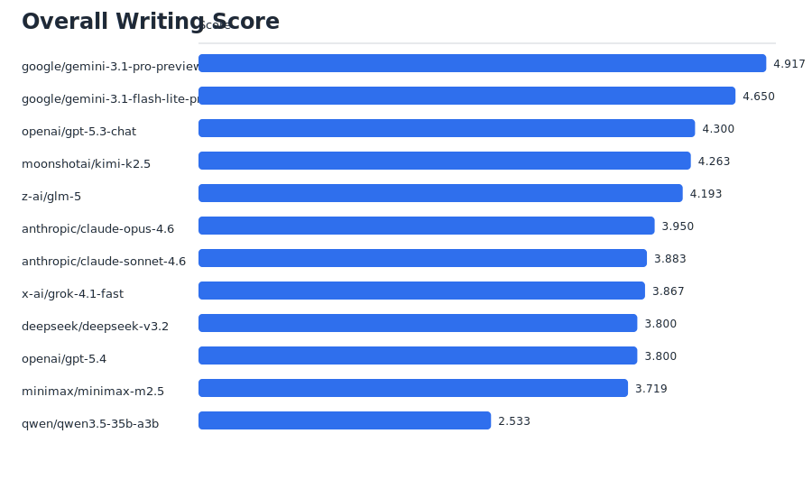
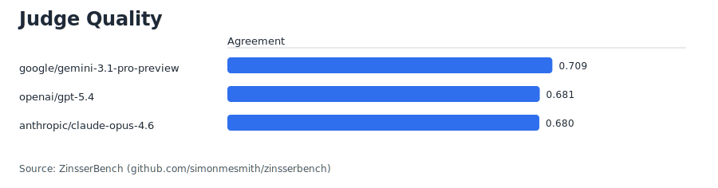

# ZinsserBench Report: 2026-03-07-openrouter-v0-1-salvage-1

- Benchmark version: `v0.1`
- Models evaluated: `12`
- Quarantined outputs excluded from scoring: `3`

## Overall writing leaderboard

| candidate_model_id | overall | clarity | simplicity | structure_flow |
| --- | --- | --- | --- | --- |
| google/gemini-3.1-pro-preview | 4.9167 | 5.0 | 4.2833 | 5.0 |
| google/gemini-3.1-flash-lite-preview | 4.65 | 4.9833 | 4.1833 | 5.0 |
| openai/gpt-5.3-chat | 4.3 | 4.8 | 4.8167 | 4.25 |
| moonshotai/kimi-k2.5 | 4.2632 | 4.7895 | 4.2807 | 4.3158 |
| z-ai/glm-5 | 4.193 | 4.7895 | 4.4211 | 4.2982 |
| anthropic/claude-opus-4.6 | 3.95 | 4.6667 | 4.4833 | 3.85 |
| anthropic/claude-sonnet-4.6 | 3.8833 | 4.6834 | 4.5834 | 3.8667 |
| x-ai/grok-4.1-fast | 3.8667 | 4.7167 | 4.0167 | 3.9 |
| deepseek/deepseek-v3.2 | 3.8 | 4.65 | 4.3167 | 3.95 |
| openai/gpt-5.4 | 3.8 | 4.6333 | 4.6833 | 3.7167 |
| minimax/minimax-m2.5 | 3.7193 | 4.6141 | 4.5439 | 3.8597 |
| qwen/qwen3.5-35b-a3b | 2.5333 | 3.25 | 3.2167 | 2.6167 |

## Judge quality leaderboard

| judge_model_id | agreement_overall | agreement_clarity | agreement_structure_flow |
| --- | --- | --- | --- |
| google/gemini-3.1-pro-preview | 0.7085 | 0.7476 | 0.7043 |
| openai/gpt-5.4 | 0.681 | 0.6345 | 0.597 |
| anthropic/claude-opus-4.6 | 0.6801 | 0.7633 | 0.6743 |

## Quarantined outputs

| candidate_model_id | prompt_id | reason | word_count | minimum_words |
| --- | --- | --- | --- | --- |
| minimax/minimax-m2.5 | oped_bus_lanes | too_short | 150 | 200 |
| moonshotai/kimi-k2.5 | oped_bus_lanes | too_short | 112 | 200 |
| z-ai/glm-5 | oped_library_hours | too_short | 87 | 200 |

## Analysis files

- `quarantined_outputs.csv`
- `response_lengths_by_model.csv`
- `writing_by_model.csv`
- `writing_by_model_axis.csv`
- `writing_by_model_category.csv`
- `writing_by_model_prompt.csv`
- `writing_by_prompt_axis.csv`
- `judge_quality.csv`
- `model_prompt_details.csv`

## Charts

