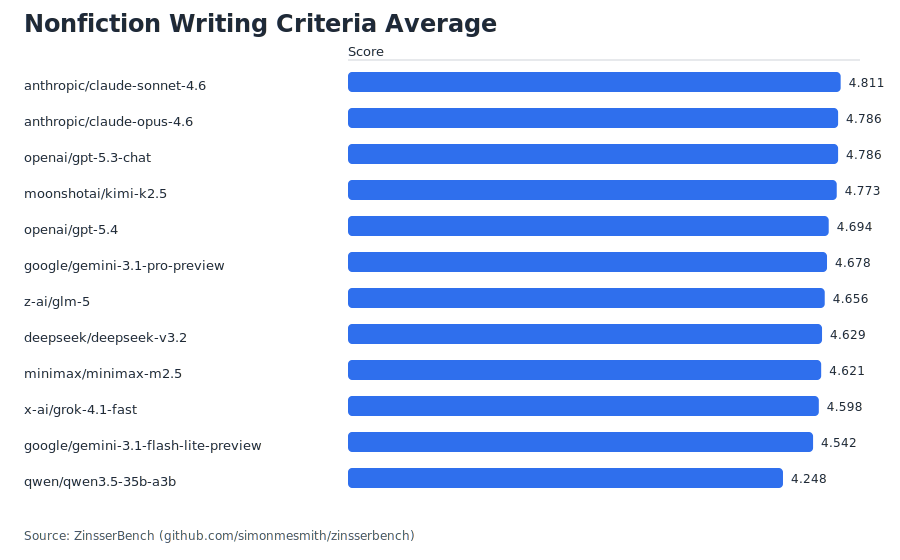
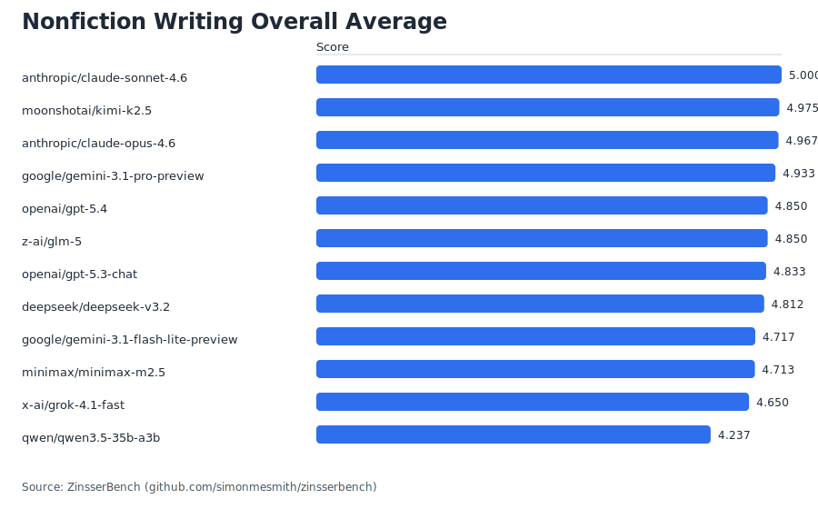
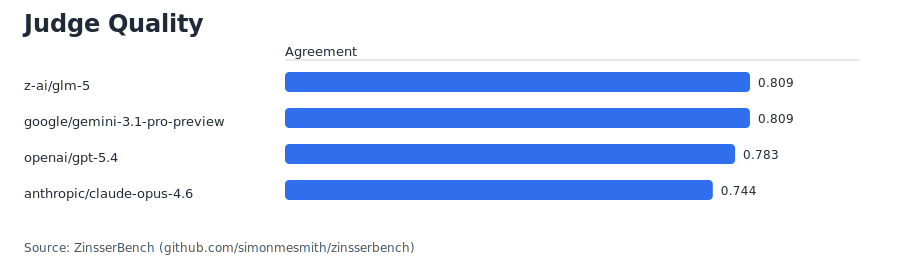
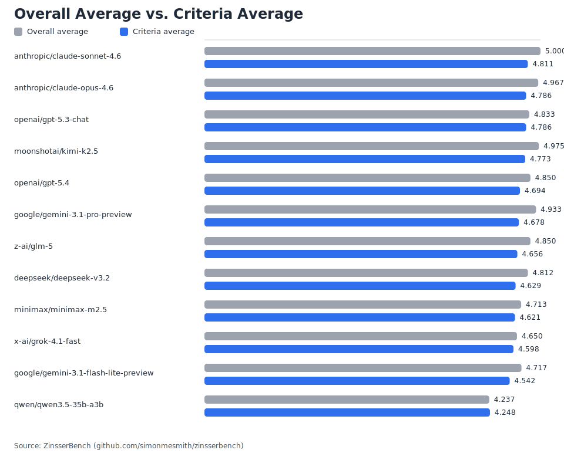
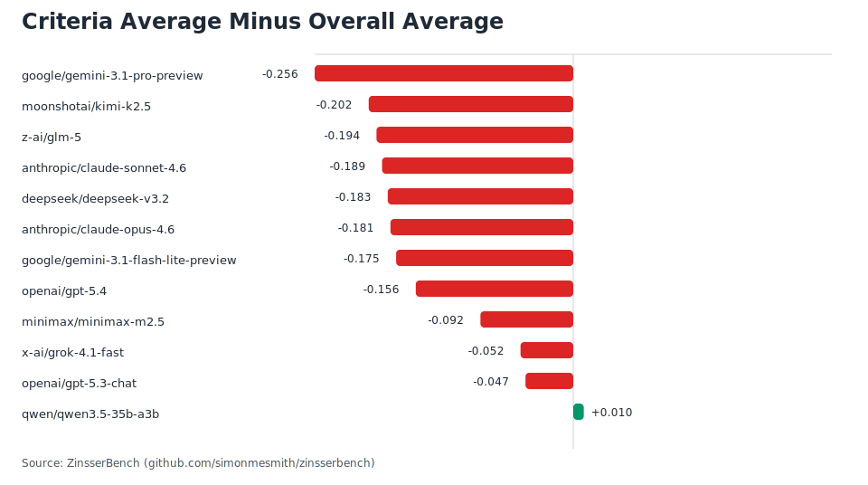
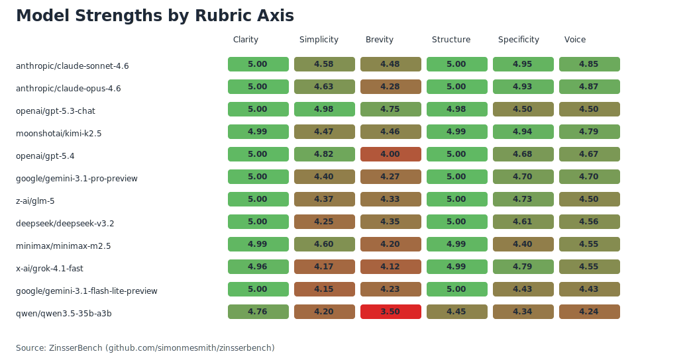

# ZinsserBench Report: 2026-03-08-openrouter-v0-2-clean-3

- Benchmark version: `v0.2`
- Models evaluated: `12`
- Quarantined outputs excluded from scoring: `0`
- Outputs with truncation warnings: `0`
- Outputs sanitized before judging: `6`
- Same-company judgments skipped: `140`

## Writing leaderboard

| candidate_model_id | criteria_average | overall_average | criteria_minus_overall | clarity | simplicity | structure_flow |
| --- | --- | --- | --- | --- | --- | --- |
| anthropic/claude-sonnet-4.6 | 4.8111 | 5.0 | -0.1889 | 5.0 | 4.5834 | 5.0 |
| anthropic/claude-opus-4.6 | 4.7861 | 4.9667 | -0.1806 | 5.0 | 4.6334 | 5.0 |
| openai/gpt-5.3-chat | 4.7861 | 4.8333 | -0.0472 | 5.0 | 4.9833 | 4.9833 |
| moonshotai/kimi-k2.5 | 4.7729 | 4.975 | -0.2021 | 4.9875 | 4.475 | 4.9875 |
| openai/gpt-5.4 | 4.6944 | 4.85 | -0.1556 | 5.0 | 4.8167 | 5.0 |
| google/gemini-3.1-pro-preview | 4.6778 | 4.9333 | -0.2555 | 5.0 | 4.4 | 5.0 |
| z-ai/glm-5 | 4.6556 | 4.85 | -0.1944 | 5.0 | 4.3667 | 5.0 |
| deepseek/deepseek-v3.2 | 4.6292 | 4.8125 | -0.1833 | 5.0 | 4.25 | 5.0 |
| minimax/minimax-m2.5 | 4.6208 | 4.7125 | -0.0917 | 4.9875 | 4.6 | 4.9875 |
| x-ai/grok-4.1-fast | 4.5979 | 4.65 | -0.0521 | 4.9625 | 4.175 | 4.9875 |
| google/gemini-3.1-flash-lite-preview | 4.5417 | 4.7167 | -0.175 | 5.0 | 4.15 | 5.0 |
| qwen/qwen3.5-35b-a3b | 4.2479 | 4.2375 | 0.0104 | 4.7625 | 4.2 | 4.45 |

Criteria average is the primary headline metric. It averages the six rubric criteria for each judged item, then averages those item-level means across the benchmark. Overall average is retained as a secondary diagnostic based on the judges' explicit overall scores.

## Judge quality leaderboard

| judge_model_id | agreement_overall | agreement_clarity | agreement_structure_flow |
| --- | --- | --- | --- |
| z-ai/glm-5 | 0.8088 | 0.9677 | 0.9558 |
| google/gemini-3.1-pro-preview | 0.8086 | 0.9677 | 0.9608 |
| openai/gpt-5.4 | 0.7828 | 0.9524 | 0.9419 |
| anthropic/claude-opus-4.6 | 0.744 | 0.9646 | 0.9434 |

## Quarantined outputs

None.

## Generation warnings

### Exact cap hits

| candidate_model_id | prompt_id | completion_tokens | max_output_tokens |
| --- | --- | --- | --- |
| qwen/qwen3.5-35b-a3b | personal_public_pool | 29943 | 10000 |

### Truncation warnings

None.

### Sanitization warnings

| candidate_model_id | prompt_id | removed_ratio | patterns | generation_attempt |
| --- | --- | --- | --- | --- |
| qwen/qwen3.5-35b-a3b | explain_heat_pumps | 0.0025 | thinking_prefix | 1 |
| qwen/qwen3.5-35b-a3b | howto_school_board_comment | 0.0018 | thinking_prefix | 1 |
| qwen/qwen3.5-35b-a3b | memo_incident_response | 0.0034 | thinking_prefix | 1 |
| qwen/qwen3.5-35b-a3b | memo_remote_work_policy | 0.0022 | thinking_prefix | 1 |
| qwen/qwen3.5-35b-a3b | oped_corner_store | 0.0023 | thinking_prefix | 1 |
| qwen/qwen3.5-35b-a3b | personal_night_shift_bus | 0.0021 | thinking_prefix | 1 |

### Skipped same-company judgments

| candidate_model_id | prompt_id | judge_model_id | company |
| --- | --- | --- | --- |
| anthropic/claude-opus-4.6 | explain_food_recall | anthropic/claude-opus-4.6 | anthropic |
| anthropic/claude-opus-4.6 | explain_heat_pumps | anthropic/claude-opus-4.6 | anthropic |
| anthropic/claude-opus-4.6 | explain_municipal_bonds | anthropic/claude-opus-4.6 | anthropic |
| anthropic/claude-opus-4.6 | explain_property_tax | anthropic/claude-opus-4.6 | anthropic |
| anthropic/claude-opus-4.6 | howto_neighborhood_meeting | anthropic/claude-opus-4.6 | anthropic |
| anthropic/claude-opus-4.6 | howto_report_water_leak | anthropic/claude-opus-4.6 | anthropic |
| anthropic/claude-opus-4.6 | howto_school_board_comment | anthropic/claude-opus-4.6 | anthropic |
| anthropic/claude-opus-4.6 | memo_budget_freeze | anthropic/claude-opus-4.6 | anthropic |
| anthropic/claude-opus-4.6 | memo_incident_response | anthropic/claude-opus-4.6 | anthropic |
| anthropic/claude-opus-4.6 | memo_remote_work_policy | anthropic/claude-opus-4.6 | anthropic |
| anthropic/claude-opus-4.6 | memo_schedule_change | anthropic/claude-opus-4.6 | anthropic |
| anthropic/claude-opus-4.6 | oped_bus_lanes | anthropic/claude-opus-4.6 | anthropic |
| anthropic/claude-opus-4.6 | oped_corner_store | anthropic/claude-opus-4.6 | anthropic |
| anthropic/claude-opus-4.6 | oped_library_hours | anthropic/claude-opus-4.6 | anthropic |
| anthropic/claude-opus-4.6 | personal_first_day_union_job | anthropic/claude-opus-4.6 | anthropic |
| anthropic/claude-opus-4.6 | personal_night_shift_bus | anthropic/claude-opus-4.6 | anthropic |
| anthropic/claude-opus-4.6 | personal_public_pool | anthropic/claude-opus-4.6 | anthropic |
| anthropic/claude-opus-4.6 | profile_ferry_captain | anthropic/claude-opus-4.6 | anthropic |
| anthropic/claude-opus-4.6 | profile_public_defender | anthropic/claude-opus-4.6 | anthropic |
| anthropic/claude-opus-4.6 | profile_school_custodian | anthropic/claude-opus-4.6 | anthropic |
| anthropic/claude-sonnet-4.6 | explain_food_recall | anthropic/claude-opus-4.6 | anthropic |
| anthropic/claude-sonnet-4.6 | explain_heat_pumps | anthropic/claude-opus-4.6 | anthropic |
| anthropic/claude-sonnet-4.6 | explain_municipal_bonds | anthropic/claude-opus-4.6 | anthropic |
| anthropic/claude-sonnet-4.6 | explain_property_tax | anthropic/claude-opus-4.6 | anthropic |
| anthropic/claude-sonnet-4.6 | howto_neighborhood_meeting | anthropic/claude-opus-4.6 | anthropic |
| anthropic/claude-sonnet-4.6 | howto_report_water_leak | anthropic/claude-opus-4.6 | anthropic |
| anthropic/claude-sonnet-4.6 | howto_school_board_comment | anthropic/claude-opus-4.6 | anthropic |
| anthropic/claude-sonnet-4.6 | memo_budget_freeze | anthropic/claude-opus-4.6 | anthropic |
| anthropic/claude-sonnet-4.6 | memo_incident_response | anthropic/claude-opus-4.6 | anthropic |
| anthropic/claude-sonnet-4.6 | memo_remote_work_policy | anthropic/claude-opus-4.6 | anthropic |
| anthropic/claude-sonnet-4.6 | memo_schedule_change | anthropic/claude-opus-4.6 | anthropic |
| anthropic/claude-sonnet-4.6 | oped_bus_lanes | anthropic/claude-opus-4.6 | anthropic |
| anthropic/claude-sonnet-4.6 | oped_corner_store | anthropic/claude-opus-4.6 | anthropic |
| anthropic/claude-sonnet-4.6 | oped_library_hours | anthropic/claude-opus-4.6 | anthropic |
| anthropic/claude-sonnet-4.6 | personal_first_day_union_job | anthropic/claude-opus-4.6 | anthropic |
| anthropic/claude-sonnet-4.6 | personal_night_shift_bus | anthropic/claude-opus-4.6 | anthropic |
| anthropic/claude-sonnet-4.6 | personal_public_pool | anthropic/claude-opus-4.6 | anthropic |
| anthropic/claude-sonnet-4.6 | profile_ferry_captain | anthropic/claude-opus-4.6 | anthropic |
| anthropic/claude-sonnet-4.6 | profile_public_defender | anthropic/claude-opus-4.6 | anthropic |
| anthropic/claude-sonnet-4.6 | profile_school_custodian | anthropic/claude-opus-4.6 | anthropic |
| google/gemini-3.1-flash-lite-preview | explain_food_recall | google/gemini-3.1-pro-preview | google |
| google/gemini-3.1-flash-lite-preview | explain_heat_pumps | google/gemini-3.1-pro-preview | google |
| google/gemini-3.1-flash-lite-preview | explain_municipal_bonds | google/gemini-3.1-pro-preview | google |
| google/gemini-3.1-flash-lite-preview | explain_property_tax | google/gemini-3.1-pro-preview | google |
| google/gemini-3.1-flash-lite-preview | howto_neighborhood_meeting | google/gemini-3.1-pro-preview | google |
| google/gemini-3.1-flash-lite-preview | howto_report_water_leak | google/gemini-3.1-pro-preview | google |
| google/gemini-3.1-flash-lite-preview | howto_school_board_comment | google/gemini-3.1-pro-preview | google |
| google/gemini-3.1-flash-lite-preview | memo_budget_freeze | google/gemini-3.1-pro-preview | google |
| google/gemini-3.1-flash-lite-preview | memo_incident_response | google/gemini-3.1-pro-preview | google |
| google/gemini-3.1-flash-lite-preview | memo_remote_work_policy | google/gemini-3.1-pro-preview | google |
| google/gemini-3.1-flash-lite-preview | memo_schedule_change | google/gemini-3.1-pro-preview | google |
| google/gemini-3.1-flash-lite-preview | oped_bus_lanes | google/gemini-3.1-pro-preview | google |
| google/gemini-3.1-flash-lite-preview | oped_corner_store | google/gemini-3.1-pro-preview | google |
| google/gemini-3.1-flash-lite-preview | oped_library_hours | google/gemini-3.1-pro-preview | google |
| google/gemini-3.1-flash-lite-preview | personal_first_day_union_job | google/gemini-3.1-pro-preview | google |
| google/gemini-3.1-flash-lite-preview | personal_night_shift_bus | google/gemini-3.1-pro-preview | google |
| google/gemini-3.1-flash-lite-preview | personal_public_pool | google/gemini-3.1-pro-preview | google |
| google/gemini-3.1-flash-lite-preview | profile_ferry_captain | google/gemini-3.1-pro-preview | google |
| google/gemini-3.1-flash-lite-preview | profile_public_defender | google/gemini-3.1-pro-preview | google |
| google/gemini-3.1-flash-lite-preview | profile_school_custodian | google/gemini-3.1-pro-preview | google |
| google/gemini-3.1-pro-preview | explain_food_recall | google/gemini-3.1-pro-preview | google |
| google/gemini-3.1-pro-preview | explain_heat_pumps | google/gemini-3.1-pro-preview | google |
| google/gemini-3.1-pro-preview | explain_municipal_bonds | google/gemini-3.1-pro-preview | google |
| google/gemini-3.1-pro-preview | explain_property_tax | google/gemini-3.1-pro-preview | google |
| google/gemini-3.1-pro-preview | howto_neighborhood_meeting | google/gemini-3.1-pro-preview | google |
| google/gemini-3.1-pro-preview | howto_report_water_leak | google/gemini-3.1-pro-preview | google |
| google/gemini-3.1-pro-preview | howto_school_board_comment | google/gemini-3.1-pro-preview | google |
| google/gemini-3.1-pro-preview | memo_budget_freeze | google/gemini-3.1-pro-preview | google |
| google/gemini-3.1-pro-preview | memo_incident_response | google/gemini-3.1-pro-preview | google |
| google/gemini-3.1-pro-preview | memo_remote_work_policy | google/gemini-3.1-pro-preview | google |
| google/gemini-3.1-pro-preview | memo_schedule_change | google/gemini-3.1-pro-preview | google |
| google/gemini-3.1-pro-preview | oped_bus_lanes | google/gemini-3.1-pro-preview | google |
| google/gemini-3.1-pro-preview | oped_corner_store | google/gemini-3.1-pro-preview | google |
| google/gemini-3.1-pro-preview | oped_library_hours | google/gemini-3.1-pro-preview | google |
| google/gemini-3.1-pro-preview | personal_first_day_union_job | google/gemini-3.1-pro-preview | google |
| google/gemini-3.1-pro-preview | personal_night_shift_bus | google/gemini-3.1-pro-preview | google |
| google/gemini-3.1-pro-preview | personal_public_pool | google/gemini-3.1-pro-preview | google |
| google/gemini-3.1-pro-preview | profile_ferry_captain | google/gemini-3.1-pro-preview | google |
| google/gemini-3.1-pro-preview | profile_public_defender | google/gemini-3.1-pro-preview | google |
| google/gemini-3.1-pro-preview | profile_school_custodian | google/gemini-3.1-pro-preview | google |
| openai/gpt-5.3-chat | explain_food_recall | openai/gpt-5.4 | openai |
| openai/gpt-5.3-chat | explain_heat_pumps | openai/gpt-5.4 | openai |
| openai/gpt-5.3-chat | explain_municipal_bonds | openai/gpt-5.4 | openai |
| openai/gpt-5.3-chat | explain_property_tax | openai/gpt-5.4 | openai |
| openai/gpt-5.3-chat | howto_neighborhood_meeting | openai/gpt-5.4 | openai |
| openai/gpt-5.3-chat | howto_report_water_leak | openai/gpt-5.4 | openai |
| openai/gpt-5.3-chat | howto_school_board_comment | openai/gpt-5.4 | openai |
| openai/gpt-5.3-chat | memo_budget_freeze | openai/gpt-5.4 | openai |
| openai/gpt-5.3-chat | memo_incident_response | openai/gpt-5.4 | openai |
| openai/gpt-5.3-chat | memo_remote_work_policy | openai/gpt-5.4 | openai |
| openai/gpt-5.3-chat | memo_schedule_change | openai/gpt-5.4 | openai |
| openai/gpt-5.3-chat | oped_bus_lanes | openai/gpt-5.4 | openai |
| openai/gpt-5.3-chat | oped_corner_store | openai/gpt-5.4 | openai |
| openai/gpt-5.3-chat | oped_library_hours | openai/gpt-5.4 | openai |
| openai/gpt-5.3-chat | personal_first_day_union_job | openai/gpt-5.4 | openai |
| openai/gpt-5.3-chat | personal_night_shift_bus | openai/gpt-5.4 | openai |
| openai/gpt-5.3-chat | personal_public_pool | openai/gpt-5.4 | openai |
| openai/gpt-5.3-chat | profile_ferry_captain | openai/gpt-5.4 | openai |
| openai/gpt-5.3-chat | profile_public_defender | openai/gpt-5.4 | openai |
| openai/gpt-5.3-chat | profile_school_custodian | openai/gpt-5.4 | openai |
| openai/gpt-5.4 | explain_food_recall | openai/gpt-5.4 | openai |
| openai/gpt-5.4 | explain_heat_pumps | openai/gpt-5.4 | openai |
| openai/gpt-5.4 | explain_municipal_bonds | openai/gpt-5.4 | openai |
| openai/gpt-5.4 | explain_property_tax | openai/gpt-5.4 | openai |
| openai/gpt-5.4 | howto_neighborhood_meeting | openai/gpt-5.4 | openai |
| openai/gpt-5.4 | howto_report_water_leak | openai/gpt-5.4 | openai |
| openai/gpt-5.4 | howto_school_board_comment | openai/gpt-5.4 | openai |
| openai/gpt-5.4 | memo_budget_freeze | openai/gpt-5.4 | openai |
| openai/gpt-5.4 | memo_incident_response | openai/gpt-5.4 | openai |
| openai/gpt-5.4 | memo_remote_work_policy | openai/gpt-5.4 | openai |
| openai/gpt-5.4 | memo_schedule_change | openai/gpt-5.4 | openai |
| openai/gpt-5.4 | oped_bus_lanes | openai/gpt-5.4 | openai |
| openai/gpt-5.4 | oped_corner_store | openai/gpt-5.4 | openai |
| openai/gpt-5.4 | oped_library_hours | openai/gpt-5.4 | openai |
| openai/gpt-5.4 | personal_first_day_union_job | openai/gpt-5.4 | openai |
| openai/gpt-5.4 | personal_night_shift_bus | openai/gpt-5.4 | openai |
| openai/gpt-5.4 | personal_public_pool | openai/gpt-5.4 | openai |
| openai/gpt-5.4 | profile_ferry_captain | openai/gpt-5.4 | openai |
| openai/gpt-5.4 | profile_public_defender | openai/gpt-5.4 | openai |
| openai/gpt-5.4 | profile_school_custodian | openai/gpt-5.4 | openai |
| z-ai/glm-5 | explain_food_recall | z-ai/glm-5 | z-ai |
| z-ai/glm-5 | explain_heat_pumps | z-ai/glm-5 | z-ai |
| z-ai/glm-5 | explain_municipal_bonds | z-ai/glm-5 | z-ai |
| z-ai/glm-5 | explain_property_tax | z-ai/glm-5 | z-ai |
| z-ai/glm-5 | howto_neighborhood_meeting | z-ai/glm-5 | z-ai |
| z-ai/glm-5 | howto_report_water_leak | z-ai/glm-5 | z-ai |
| z-ai/glm-5 | howto_school_board_comment | z-ai/glm-5 | z-ai |
| z-ai/glm-5 | memo_budget_freeze | z-ai/glm-5 | z-ai |
| z-ai/glm-5 | memo_incident_response | z-ai/glm-5 | z-ai |
| z-ai/glm-5 | memo_remote_work_policy | z-ai/glm-5 | z-ai |
| z-ai/glm-5 | memo_schedule_change | z-ai/glm-5 | z-ai |
| z-ai/glm-5 | oped_bus_lanes | z-ai/glm-5 | z-ai |
| z-ai/glm-5 | oped_corner_store | z-ai/glm-5 | z-ai |
| z-ai/glm-5 | oped_library_hours | z-ai/glm-5 | z-ai |
| z-ai/glm-5 | personal_first_day_union_job | z-ai/glm-5 | z-ai |
| z-ai/glm-5 | personal_night_shift_bus | z-ai/glm-5 | z-ai |
| z-ai/glm-5 | personal_public_pool | z-ai/glm-5 | z-ai |
| z-ai/glm-5 | profile_ferry_captain | z-ai/glm-5 | z-ai |
| z-ai/glm-5 | profile_public_defender | z-ai/glm-5 | z-ai |
| z-ai/glm-5 | profile_school_custodian | z-ai/glm-5 | z-ai |

## Analysis files

- `quarantined_outputs.csv`
- `exact_cap_hits.csv`
- `truncation_warnings.csv`
- `sanitization_warnings.csv`
- `skipped_same_company_judgments.csv`
- `excluded_for_insufficient_judges.csv`
- `response_lengths_by_model.csv`
- `writing_by_model.csv`
- `writing_by_model_axis.csv`
- `writing_by_model_category.csv`
- `writing_by_model_prompt.csv`
- `writing_by_prompt_axis.csv`
- `judge_quality.csv`
- `model_prompt_details.csv`

## Charts

