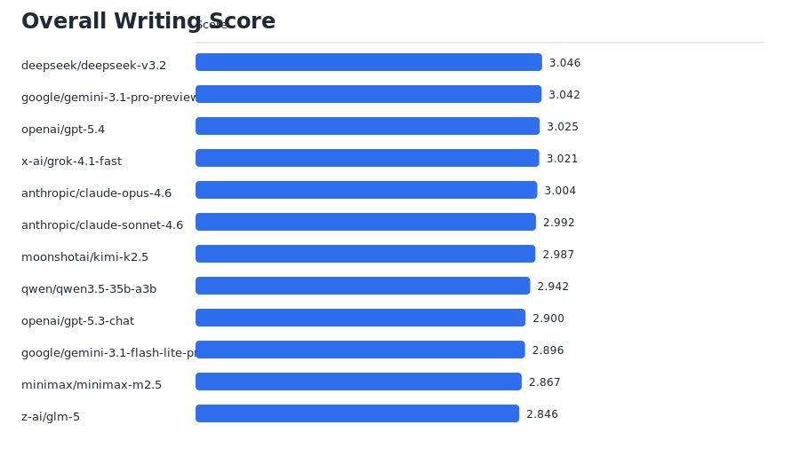
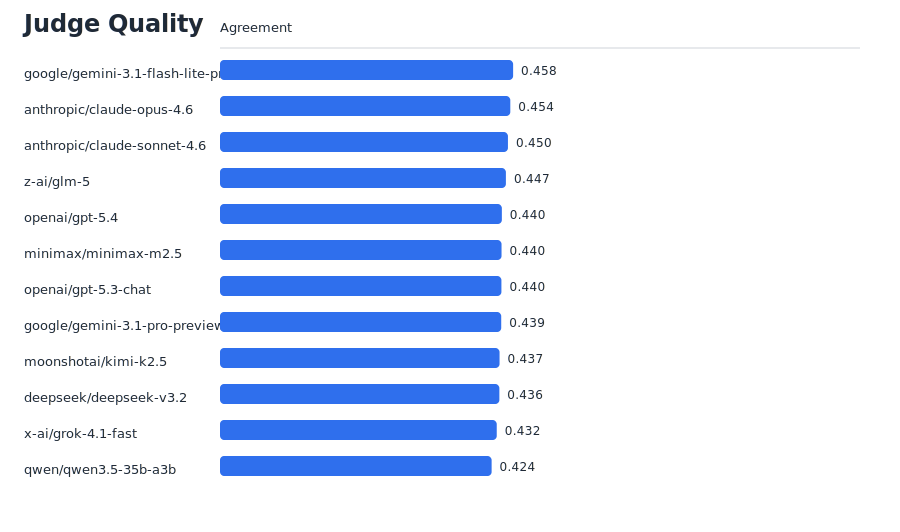

# ZinsserBench Report: example-v0-1-12-models

- Benchmark version: `v0.1`
- Models evaluated: `12`

## Overall writing leaderboard

| candidate_model_id | overall | clarity | simplicity | structure_flow |
| --- | --- | --- | --- | --- |
| deepseek/deepseek-v3.2 | 3.0458 | 3.0458 | 3.0458 | 2.9625 |
| google/gemini-3.1-pro-preview | 3.0417 | 3.0 | 3.0417 | 3.0833 |
| openai/gpt-5.4 | 3.025 | 2.9833 | 3.025 | 2.9625 |
| x-ai/grok-4.1-fast | 3.0208 | 3.0208 | 3.0208 | 2.9375 |
| anthropic/claude-opus-4.6 | 3.0042 | 2.8167 | 3.0042 | 3.1083 |
| anthropic/claude-sonnet-4.6 | 2.9917 | 2.9917 | 2.9917 | 2.9083 |
| moonshotai/kimi-k2.5 | 2.9875 | 3.05 | 2.9875 | 2.9458 |
| qwen/qwen3.5-35b-a3b | 2.9417 | 2.9625 | 2.9417 | 3.025 |
| openai/gpt-5.3-chat | 2.9 | 2.8375 | 2.9 | 3.0458 |
| google/gemini-3.1-flash-lite-preview | 2.8958 | 2.8958 | 2.8958 | 3.0208 |
| minimax/minimax-m2.5 | 2.8667 | 3.1375 | 2.8667 | 3.1167 |
| z-ai/glm-5 | 2.8458 | 3.075 | 2.8458 | 2.9917 |

## Judge quality leaderboard

| judge_model_id | agreement_overall | agreement_clarity | agreement_structure_flow |
| --- | --- | --- | --- |
| google/gemini-3.1-flash-lite-preview | 0.458 | 0.4339 | 0.4361 |
| anthropic/claude-opus-4.6 | 0.4536 | 0.4456 | 0.4355 |
| anthropic/claude-sonnet-4.6 | 0.4499 | 0.4382 | 0.4329 |
| z-ai/glm-5 | 0.4467 | 0.4403 | 0.4329 |
| openai/gpt-5.4 | 0.4404 | 0.4384 | 0.4469 |
| minimax/minimax-m2.5 | 0.4399 | 0.4394 | 0.4407 |
| openai/gpt-5.3-chat | 0.4397 | 0.4461 | 0.4396 |
| google/gemini-3.1-pro-preview | 0.4394 | 0.4308 | 0.4582 |
| moonshotai/kimi-k2.5 | 0.4368 | 0.4484 | 0.4332 |
| deepseek/deepseek-v3.2 | 0.4365 | 0.4491 | 0.4399 |
| x-ai/grok-4.1-fast | 0.4324 | 0.4572 | 0.4462 |
| qwen/qwen3.5-35b-a3b | 0.4244 | 0.4175 | 0.4531 |

## Analysis files

- `writing_by_model.csv`
- `writing_by_model_axis.csv`
- `writing_by_model_category.csv`
- `writing_by_model_prompt.csv`
- `writing_by_prompt_axis.csv`
- `judge_quality.csv`
- `model_prompt_details.csv`

## Charts

